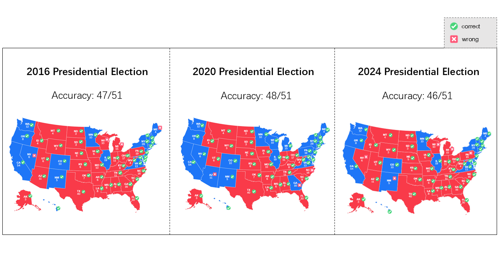

# ElectionSim: Massive Population Election Simulation Powered by Large Language Model Driven Agents

ElectionSim is a large-scale election simulation framework powered by Large Language Models (LLMs). It aims to simulate individual voter behavior and aggregate public opinion to provide an efficient and cost-effective alternative to traditional opinion polling. This repository contains the complete implementation, including LLM deployment, individual-level simulation, and state-level simulation.


## Project Overview

In 2024, over 4.2 billion people participated in elections worldwide, making it the largest collective human activity in history. Election outcomes shape the future of nations and profoundly impact public life. However, traditional opinion polling methods face challenges such as high costs and increasing refusal rates, which erode their accuracy. Leveraging the success of LLMs in role-playing tasks, ElectionSim uses LLMs to simulate individual voter opinions and aggregate them to predict election outcomes.

Key contributions of this work:

- **Electionsim**: a massive election simulation framework that supports diverse election scenarios with high reliability, leveraging a flexible and customizable distribution sampling strategy to align with real-world demographics.
- **Million-level voters pool**: a large and diverse voter pool to support massive population election simulations, created by collecting and integrating data from social media platforms.
- **PPE**: Poll-based Presidential Election~(PPE) Benchmark, the first publicly available benchmark for evaluating voting behavior simulations, enabling future research to build upon and refine our results in this rapidly evolving field.
- **Simulating trends and shocks**: developing the capability of accurately simulating the impacts of policy changes, demographic trends, and political shocks.



## News

- [2025-02-12] Initial release of ElectionSim.


## Getting Started

### 1. Environment Setup

Run the following code to install environment dependencies:

```bash
pip install -r requirements.txt
```


### 2. LLM Deployment
Here is an example showing how to quickly deploy a model based on vllm:
```bash
export CUDA_VISIBLE_DEVICES=0,1,2,3
python -m vllm.entrypoints.openai.api_server \
    --model /your_local_path/Qwen2.5-72B-Instruct \
    --served_model_name qwen2.5-72b \
    --tensor-parallel-size 4 \
    --max-model-len 4096 \
    --enable-prefix-caching \
    --enforce-eager \
    --host 0.0.0.0 \
    --port 1357
```

Or you can simply run code:

```bash
bash vllm_deploy.sh
```


### 3. Individual-Level Simulation

First, enter the corresponding working directory according to the year to be simulated, for example, `cd /individual_level_simu/2020`. Then execute the following code to simulate:

```bash
python3 simu.py
```


### 4. State-Level Simulation
First, execute `cd /state_level_simu` to enter the working directory.

For the 2016 election simulation, execute the following code to simulate a state:
```bash
python sim2016.py --poll_path "${poll_path}" 
				  --baseline "${baseline}" 
				  --pattern "${pattern}" 
				  --state_name "${state_name}" 
				  --user_profile_folder "${user_profile_folder}" 
				  --output_path "${output_path}" 
				  --model "${model}" 
				  --num_threads "${num_threads}"
```

You can also modify the corresponding parameters in the shell script to directly complete the simulation of all states:

```bash
bash sim2016.sh
```


For the 2020 and 2024 election simulations, execute the following code to simulate a state:

```bash
python sim.py --poll_path "${poll_path}" 
              --baseline "${baseline}" 
              --pattern "${pattern}" 
              --state_name "${state_name}" 
              --user_profile_folder "${user_profile_folder}" 
              --output_path "${output_path}" 
              --model "${model}" 
              --num_threads "${num_threads}"
```

You can also modify the corresponding parameters in the shell script to directly complete the simulation of all states:

```bash
bash sim.sh
```


During simulation, you can specify the corresponding files in the `users` folder to determine the simulated population and explore the changes in the sampling ratio. The naming format of each folder in the users folder is the corresponding year + sampling ratio. For example, the folder `2024_10000` represents the 1/10,000 sampling ratio result of the population in 2024.


## License

This project is licensed under the MIT License. Please see the [LICENSE](https://opensource.org/license/MIT) file for details.


## Acknowledgments

This research was supported by Fudan University, Indiana University, and the University of Rochester. We thank all team members involved in data collection and annotation, as well as colleagues who provided valuable feedback.


## Contact

For any questions or feedback, please contact us via:

- Email: [jiayulin24@m.fudan.edu.cn](jiayulin24@m.fudan.edu.cn)
